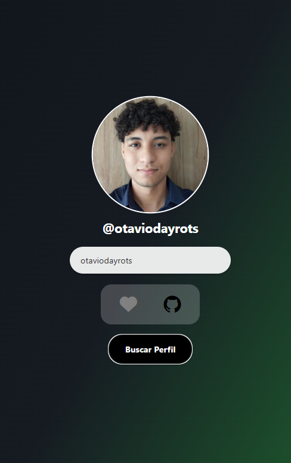
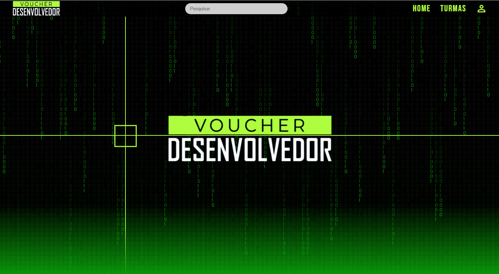
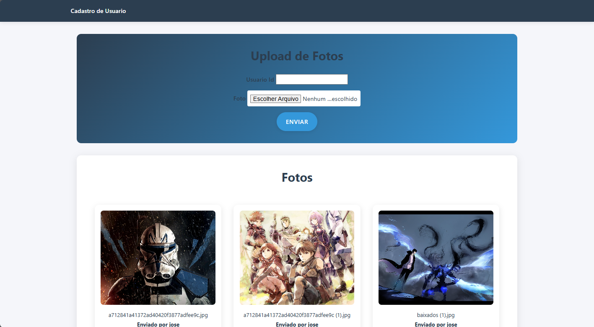
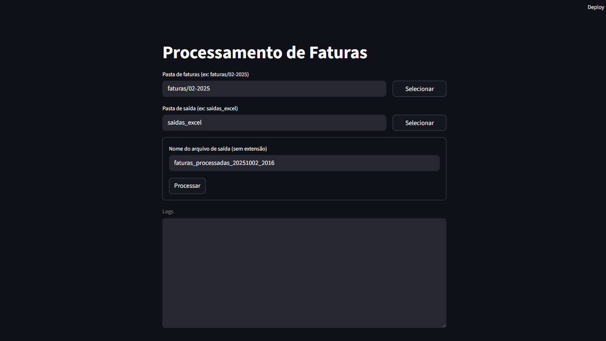

# Portfólio

Bem-vindo ao meu portfólio! Aqui você encontra uma coleção de projetos, estudos e experimentos front-end. O objetivo é apresentar habilidades em HTML, CSS (incluindo utilitários no estilo Tailwind) e JavaScript, além de boas práticas de estruturação, acessibilidade e performance.

## 🔗 Demo
- Publicação (GitHub Pages ou similar): https://portifolio-c01.pages.dev
- Visualização local: abra o arquivo `index.html` diretamente no navegador ou use uma extensão como Live Server.

## 🖼️ Prévia
Algumas capturas dos projetos destacados (as imagens estão em `public/Image`):







## 🧰 Tecnologias e Recursos
- HTML5 semântico
- CSS3
- Utilitários ao estilo Tailwind (`Src/styles/tailwindglobal.js`)
- JavaScript (client-side)

## 📁 Estrutura do Projeto
```text
D:\GitHub\Portifolio\
  ├─ index.html
  ├─ public\
  │  └─ Image\
  │     ├─ energy.png
  │     ├─ filmesDB.png
  │     ├─ find_github.png
  │     ├─ galeria_voucher.png
  │     └─ image_share.png
  └─ Src\
     ├─ styles\
     │  ├─ global.css
     │  └─ tailwindglobal.js
     └─ views\
        └─ contato.html
```

- `index.html`: página principal do portfólio.
- `Src/styles/global.css`: estilos globais adicionais.
- `Src/styles/tailwindglobal.js`: utilitários/ajustes no estilo Tailwind para composição rápida de estilos.
- `Src/views/contato.html`: página/section de contato.
- `public/Image`: assets estáticos (imagens de prévia dos projetos).

## ▶️ Como rodar localmente
- Opção 1 (rápida): clique duas vezes em `index.html` para abrir no navegador.
- Opção 2 (recomendada): use um servidor local (ex.: extensão Live Server do VS Code)
  1. Abra a pasta do projeto no VS Code
  2. Instale/ative o Live Server
  3. Clique em “Go Live” e acesse o endereço exibido (geralmente `http://127.0.0.1:5500/`)

## 🧭 Navegação e Conteúdo
- Seções do `index.html` apresentam projetos com imagens, descrições e links.
- A página `Src/views/contato.html` contém informações e formulário de contato (se aplicável).

## ♿ Acessibilidade e SEO (recomendações adotadas/planejadas)
- Elementos semânticos (`<header>`, `<main>`, `<section>`, etc.)
- Texto alternativo (`alt`) em imagens e contraste adequado
- Metadados básicos (título, descrição) e uso criterioso de headings

## 🚀 Deploy (GitHub Pages)
1. Faça commit e push para a branch `main`
2. No GitHub, acesse Settings → Pages
3. Em “Build and deployment”, selecione “Deploy from a branch”
4. Branch: `main`, pasta `/root` e salve
5. Aguarde a publicação e atualize o link na seção “Demo”

## 🤝 Contribuição
- Sugestões e melhorias são bem-vindas via Issues e Pull Requests
- Para alterações maiores, descreva sua proposta antes de abrir o PR

## 📫 Contato
- Substitua pelos seus canais preferidos:
  - Email: seu.email@exemplo.com
  - LinkedIn: https://www.linkedin.com/in/joseotaviodayrots
  - GitHub: https://github.com/OtavioDayrots

## 📄 Licença
No momento este repositório não possui uma licença explícita. Caso deseje reutilizar conteúdo/código, por favor, abra uma Issue para alinharmos a melhor forma de uso.

---
Se este portfólio foi útil ou inspirador, considere deixar uma estrela no repositório!
